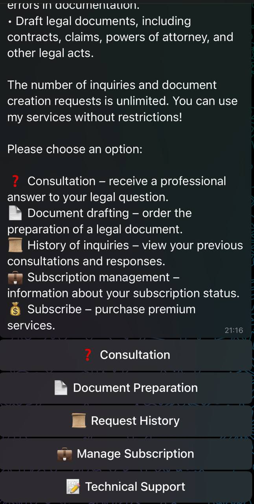

# ⚖️ Legal Assistant Telegram Bot

[](https://www.python.org/)
[](LICENSE)
**A Telegram bot providing AI-powered legal consultations, automated legal document generation, and subscription/payment
management.**

Designed for reliable, accessible legal assistance with seamless document workflows and payment integration.

🤝 **Collaborated with:** [LotarievArtem](https://github.com/ArDangerUS)  
🛠️ **Professional project completed via [Upwork](https://www.upwork.com)** - Delivered as a comprehensive freelance
solution for legal technology automation

---

## 📋 Table of Contents

- [🌟 Why This Bot?](#-why-this-bot)
- [🚀 Features](#-features)
- [🛠️ Tech Stack](#-tech-stack)
- [📋 Prerequisites](#-prerequisites)
- [⚡ Quick Start](#-quick-start)
- [📱 Usage](#-usage)
- [🚀 Deployment](#-deployment)
- [🔧 Development](#-development)
- [🛣️ Roadmap](#-roadmap)
- [❓ FAQ](#-faq)
- [📜 License](#-license)

---

## 🌟 Why This Bot?

- **24/7 Legal Assistance** — Get instant legal guidance without waiting for office hours
- **Cost-Effective** — Affordable alternative to expensive legal consultations
- **Document Automation** — Generate professional legal documents in minutes
- **Secure & Compliant** — Built with privacy and data protection in mind

---

## 🚀 Features

* 🤖 **AI Legal Consultation** — Get context-aware, accurate answers to legal questions
* 📄 **Legal Document Generation** — Automatically create contracts, claims, complaints, powers of attorney, and more
* 📝 **Conversation History** — View, continue, or delete past consultations and generated documents
* 💼 **Subscription Management** — Flexible tariffs with automated subscription and payment verification
* 💳 **Payment Integration** — Powered by YooKassa API for smooth billing and payment status tracking
* 📂 **File Upload Support** — Upload legal documents in .docx, .pdf, and .txt for analysis and generation
* 🗣️ **Multi-step Dialogs** — Supports clarifications and multi-turn document creation workflows

---

## 🛠️ Tech Stack

**Backend:**

- Python 3.13+
- [python-telegram-bot](https://github.com/python-telegram-bot/python-telegram-bot) - Telegram Bot API wrapper
- OpenAI API (GPT) - Natural language understanding and document synthesis
- MongoDB - User data, session, and subscription storage

**Integrations:**

- YooKassa API - Payment processing
- aiofiles, python-docx, pypdf - Document file processing

**Configuration:**

- Environment variables via `.env` file

---

## 📋 Prerequisites

Before you begin, ensure you have:

- **Python 3.13+** installed
- **MongoDB instance** (local or cloud like MongoDB Atlas)

### Getting Required Tokens & Keys:

**1. Telegram Bot Token:**

- Message [@BotFather](https://t.me/botfather) on Telegram
- Send `/newbot` and follow the instructions
- Choose a name and username for your bot
- Copy the provided token

**2. OpenAI API Key:**

- Go to [OpenAI API Keys](https://platform.openai.com/api-keys)
- Create an account or log in
- Click "Create new secret key"
- Copy the key (starts with `sk-`)

**3. YooKassa Credentials:**

- Register at [YooKassa](https://yookassa.ru/)
- Complete merchant verification
- Get your Shop ID and Secret Key from the dashboard

**4. MongoDB Connection:**

- For local: `mongodb://localhost:27017`
- For MongoDB Atlas: Create cluster and get connection string

---

## ⚡ Quick Start

### 1. Clone the repository

```bash
git clone https://github.com/KonchakivskyiDanylo/law-tg-bot.git
cd law-tg-bot
```

### 2. Install dependencies

```bash
# Create virtual environment (recommended)
python -m venv venv
source venv/bin/activate  # On Windows: venv\Scripts\activate

# Install dependencies
pip install -r requirements.txt
```

### 3. Configure environment variables

Copy the example file and fill in your credentials:

```bash
cp .env.example .env
```

Edit `.env` file using the `.env.example` template:

### 4. Run the bot

```bash
python main.py
```

The bot will start and display a message confirming successful connection to Telegram.

---

## 📱 Usage

### Getting Started

1. Start a chat with your bot on Telegram
2. Send `/start` to begin
3. Accept the user agreement
4. Navigate through the interactive menu using inline buttons

### Bot Interface

The bot provides an intuitive menu system with the following options:



### Core Functionality

- **Ask Legal Questions**: Type any legal question and get AI-powered responses
- **Upload Documents**: Send .docx, .pdf, or .txt files for analysis
- **Generate Documents**: Follow guided prompts to create legal documents
- **Manage History**: Access, continue, or delete previous consultations
- **Handle Subscriptions**: Subscribe to premium features and manage payments

---

## 🚀 Deployment

### Heroku Deployment

This bot is optimized for Heroku deployment:

1. Create a new Heroku app
2. Set environment variables in Heroku Config Vars (same as .env file)
3. Deploy using Git or GitHub integration
4. Enable worker dyno (not web dyno) since this is a bot, not a web server

### Alternative Deployment Options

- **VPS/Cloud Server**: Run directly with `python main.py`
- **Docker**: Create Dockerfile for containerized deployment
- **PM2**: Use PM2 for process management on Linux servers

---

## 🔧 Development

### Contributing

1. Fork the repository
2. Create a feature branch (`git checkout -b feature/amazing-feature`)
3. Commit your changes (`git commit -m 'Add amazing feature'`)
4. Push to the branch (`git push origin feature/amazing-feature`)
5. Open a Pull Request

Pull requests and issues are welcome! Please open an issue before submitting major features.

---

## 🛣️ Roadmap

- 🔐 Enhanced security and privacy compliance
- 📈 Analytics dashboard for user engagement and subscriptions
- 📞 Integration with live legal support and professionals
- 🌐 Multi-language support
- 🤝 Additional payment providers and invoicing options

---

## ❓ FAQ

**Q: Is this bot free to use?**  
A: The bot offers both free and premium subscription tiers with different usage limits.

**Q: What types of legal documents can be generated?**  
A: Contracts, claims, complaints, powers of attorney, and other common legal documents.

**Q: Is the legal advice legally binding?**  
A: This bot provides informational assistance only and does not replace professional legal counsel.

---

## 📜 License

MIT License — see `LICENSE.md` for details.